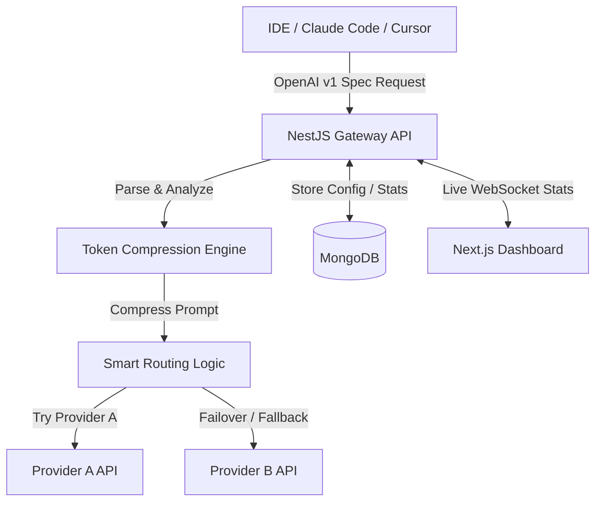

# NexusRoute 🚀

> **The Intelligent AI Nexus** — one gateway, every AI provider, $0 to start.

Connect Claude Code, Cursor, Cline, Copilot, and other agentic tools to 70+ free AI providers through a single, local intelligent gateway with smart failover routing and advanced token compression.

---

## 🌟 Key Features

* **🔌 Unified OpenAI-Compatible API Endpoint**: Translates OpenAI schema requests to Claude, Gemini, DeepSeek, and Mistral on the fly. Point any tool at `/v1`.
* **🤖 237+ Supported AI Providers**: OpenAI, Anthropic, Google Gemini, DeepSeek, Groq, Mistral, and 70+ free providers out-of-the-box (over 457+ free models).
* **🧠 Smart Fallback Routing**: Auto-fallback and failover routing strategies across providers when rate limits (`429`) or server failures (`5xx`) occur.
* **⚡ Advanced Token Compression**: Built-in RTK (Recursive Token Keeping) and Caveman prompt compression algorithms to save **15% to 95%** on tool-heavy/agentic context windows.
* **💻 Interactive Local Dashboard**: Real-time analytics, latency tracking, cost estimation, live usage logs, custom chain configuration, and API key management on a beautiful dark-mode UI.
* **🔍 IDE Auto-Detection**: Automatically detects active Cursor and Trae IDE login sessions for seamless configuration.

---

## 🚀 Quick Start

### Run with `npx` (No Installation Needed)
Start both the NestJS API gateway and the Next.js Dashboard instantly:
```bash
npx nexusroute
```

### Install Globally
```bash
npm install -g nexusroute
nexusroute
```

Once started, the CLI will automatically open your web browser to the NexusRoute Dashboard.

---

## 🛠️ CLI Usage & Flags

Configure custom ports and network options directly from the CLI:

```bash
# Start with custom ports
nexusroute --port 3000 --api-port 8080

# Run in background/headless mode (do not open browser automatically)
nexusroute --no-browser

# Stop all running NexusRoute backend and frontend processes
nexusroute stop

# Output current version
nexusroute version

# Show help menu
nexusroute help
```

### Default Port Mapping

| Service | Port | Description | URL |
| :--- | :--- | :--- | :--- |
| **Dashboard** | `4200` | Frontend Web UI (Next.js) | http://localhost:4200 |
| **API Gateway** | `4444` | Unified API Endpoint (NestJS) | http://localhost:4444/api |
| **Swagger Docs**| `4444` | Interactive API Documentation | http://localhost:4444/api/docs |

---

## ⚙️ Environment Variables

NexusRoute comes with working default configurations so you can run it out of the box with zero setup. If you want to customize your environment, create a `.env` file in the directory where you run `nexusroute`:

| Environment Variable | Default Value | Description |
| :--- | :--- | :--- |
| `MONGODB_URI` | *Cloud Sandbox Connection* | MongoDB connection string for configuration data |
| `JWT_ACCESS_SECRET` | `sdgdsgdsgsdgsdg` | Key used for encrypting dashboard session access tokens |
| `JWT_REFRESH_SECRET`| `sdgdsgsdgsd` | Key used for encrypting session refresh tokens |
| `ENCRYPTION_KEY` | *32-byte secure hex string* | Used for encrypting/decrypting your API keys at rest |
| `API_PORT` | `4444` | Local port for the NestJS API Gateway |
| `WEB_PORT` | `4200` | Local port for the Next.js Web Dashboard |

---

## 🧩 Architecture Flowchart



---

## 📄 License

MIT © NexusRoute
